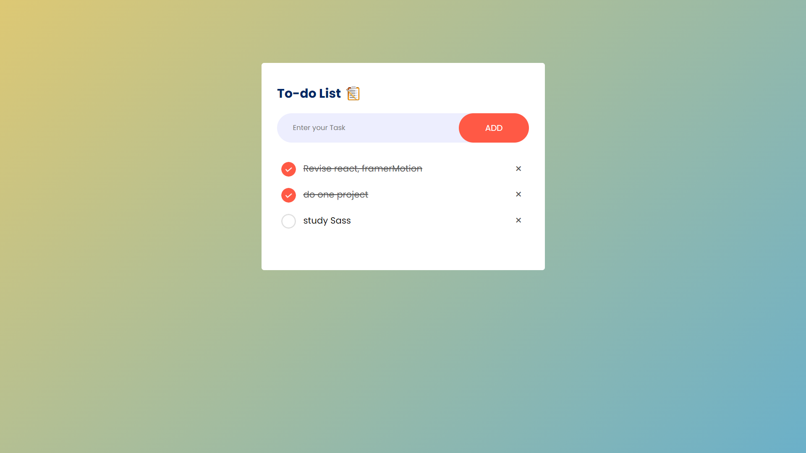

# To-Do List App

A simple and interactive to-do list application that allows users to add, mark, and remove tasks. The app uses local storage to save the tasks, ensuring they persist even after the browser is closed.
## Screenshots

### Home Screen



## Features

- **Add Tasks**: Users can add tasks to their to-do list.
- **Mark Tasks as Completed**: Click on a task to mark it as completed (it will be visually indicated).
- **Remove Tasks**: Each task has a remove button (`×`) to delete it from the list.
- **Local Storage**: The app stores tasks in the browser's local storage, so your list is saved even if you close the browser.

## Technologies Used

- **HTML**: Structure of the web page.
- **CSS**: Basic styling of the application.
- **JavaScript**: Logic to add, mark, remove tasks, and manage local storage.

## How to Use

1. **Clone the repository:**

   ```bash
   git clone https://github.com/your-username/todo-list-app.git
